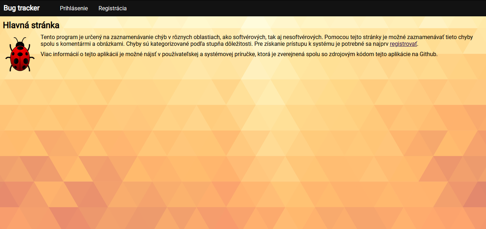
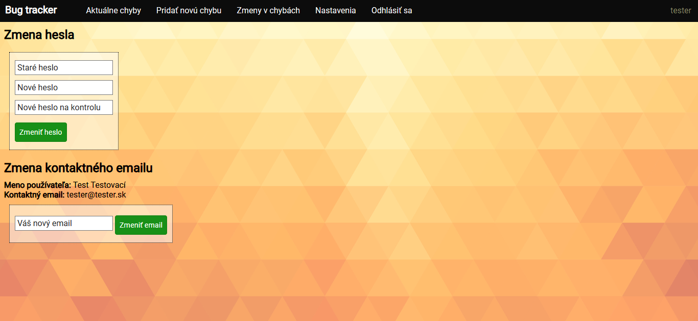
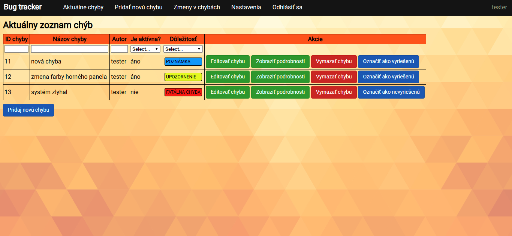
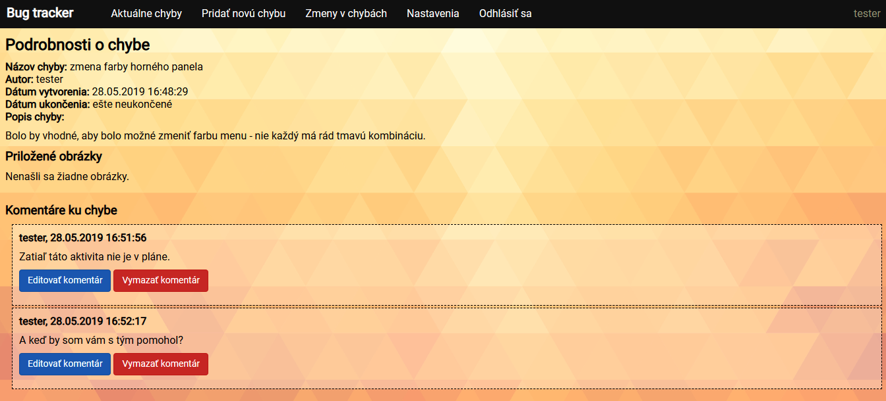
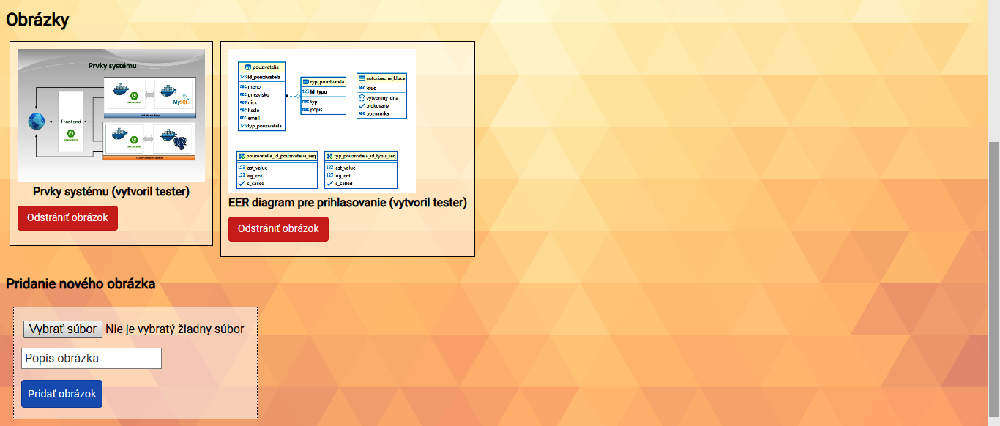
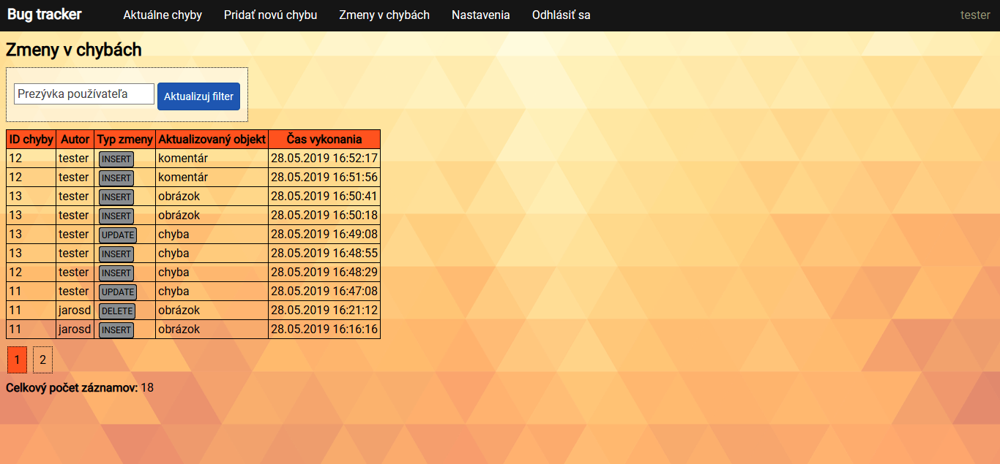

# Zaznamenávanie chýb #

Táto aplikácia vznikla ako semestrálna práca pre predmet Vývoj pokročilých aplikácií.
Aplikácia je zameraná na zaznamenávanie chýb (sofvérových, ako aj nesoftvérových). Používateľom umožňuje kolaborovať
na riešení rozličných chýb.

Z používateľského hľadiska stačí mať pre spustenie aplikácie a prácou s ňou moderný webový prehliadač.

## Používateľská príručka ##

Aplikácia umožňuje:
- správa používateľov (prihlásenie, registrácia, odhlásenie)
- zmena informácií o používateľoch (email, heslo)
- pridanie, úprava, vymazanie chyby (vymazanie len ak som autorom)
- nastavenie statusu chyby (vyriešená, nevyriešená)
- pridávanie komentárov ku chybe
- úprava a vymazávanie komentárov ku chybe (ak som autorom)
- pridávanie/vymazávanie obrázkov spojených s chybou
- zobrazenie zmien pri chybách

Pred začatím používania portálu je potrebné sa zaregistrovať. Pri registrácií sú požadované základné
údaje, ako meno, priezvisko, email, nick a vaše heslo. Následne je možné sa prihlásiť.

Snahou bolo vytvoriť čo najintuitívnejšie ovládanie aplikácie. V hornej časti obrazovky sa nachádza menu, pomocou ktorého je možné sa prepínať medzi stránkami.
Každá chyba je identfikovaná svojím názvom, popisom a dôležitosťou.
Pridávanie komentárov je možné v zobrazení podrobností daného komentára. Obrázky je možné vkladať po vytvorení danej chyby (nie počas jej vytvárania).

### Testovacie kontá ###

Pre testovacie účely sú v programe vytvorené (ak ich nevymažete) dve testovacie kontá, ktoré majú prihlasovacie meno test alebo tester. Heslo k týmto kontám
je rovnaké ako prihlasovacie meno.

### Snímky z programu ###

##### Nastavenia konta #####

##### Zoznam chýb #####

##### Podrobnosti o chybe #####

##### Pridanie obrázka k chybe #####

##### Prehľad zmien vykonaných nad zadanými chybami #####

2019