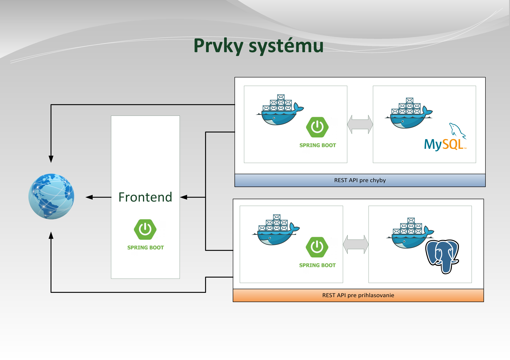
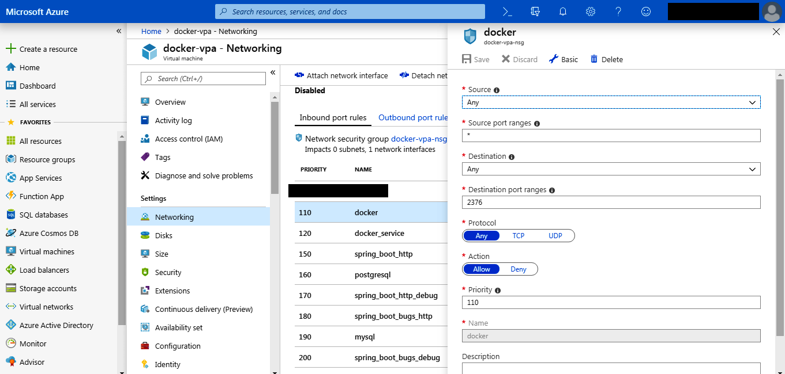
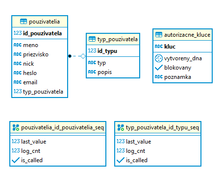
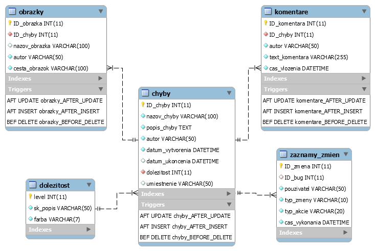

## Systémová príručka ##

Ak chcete túto aplikáciu inštalovať na vlastný stroj, tak je to trochu komplikovanejšie. V skratke sa tu budem snažiť priblížiť, akým spôsobom je to možné. Je vhodné si pozrieť základné návody pre prácu s Dockerom pred vytváraním vlastného stroja s aplikáciou. Predpokladá sa použitie IDE Intellij IDEA.

Aplikácia využíva pre jednotlivé moduly Docker. Tieto moduly som ukladal na vzdialený server (v mojom prípade Azure). K nim sa následne aplikácia s front-endom pripája a len stiahne si z nich REST odpovede.

Schematicky je možné túto situáciu vyjadriť nasledujúcim obrázkom:



Boli vytvorené dva samostané kontajnery, jeden pre prihlasovanie, v ktorom ako úložisko údajov využívam RDBMS PostgresSQL a pre uchovávanie informácií o chybách slúži ďalší kontajner. Tam som použil RDBMS MySQL.

Pri Spring Boot bola použitá verzia Javy 11.

## Vytvorenie kontajnerov ##

1. Na Azure si vytvorte konto (študentská verzia je zdarma na rok - pozrite si prípadné obmedzenia)
2. Vytvorte nový stroj s OS Linux (odskúšané s Debian)
3. Nastavte mu v nastaveniach **statickú IP adresu**
4. Nainštalujte si program docker-ce (<code>sudo apt-get update, sudo apt-get install docker-ce</code>)
5. Pri práci s Dockerom potrebujete **práva root-a**! (na originálnom stroji sa nebudú inštalovať programy, ktoré budú použité v jednotlivých kontajneroch)
6. Sprístupnite vzdialenú komunikáciu v programe Docker - návod možno nájsť tu https://success.docker.com/article/how-do-i-enable-the-remote-api-for-dockerd 
7. Nastavte výnimky pre firewall v nastaveniach Azure (pre porty 2375, 2376)



7. V IntelliJ projektoch je zapísaná konfigurácia jednotlivých kontajnerov v DockerFiles. 
8. Nezabudnite povoliť komunikáciu na portoch, ktoré sú ako vonkajšie pre jednotlivé aplikácie (napríklad pre prihlasovanie sa mi port pre pripojenie sa k databázy prekladá z 2375 na 10001)
9. Jednotlivé Dockerfiles sú spravené tak, aby po vypnutí týchto obrazov nedošlo ku strate dát v databázach (tzv. volumes).

Definície, čo sa má vykonať pred spustením stroja sú definované v DockerFiles. V prípade problémov s rozchodením konkrétneho stroja je možné ich debugovať (ak nie je spustený iný program v popredí v Dockeri, problém pri Spring Boot strojoch) je možné vyvolať príkazový riadok virtuálneho stroja príkazom

<code>sudo docker run -it <názov stroja, napríklad vpa-jarosd-bugs> /bin/bash</code>

### Nastavenie odkazu na vlastný Docker ###

1. Vo frontende si nájdite triedy, ktoré sú v podbalíčku <code>preberaci</code>
2. Link zadaný v konštante nahraďte za vlastnú adresu
3. Danú akciu vykonajte vo všetkých triedach podbalíčka

### API kľúče ###

Na testovanie REST API je možné použiť program Postman. V adresári <code>rest_api_priklady</code> je možné nájsť vzorové volania. Pri volaniach POST používajte v tele požiadavky formát JSON (okrem vkladania obrázkov, tam je potrebný formát <code>multipart/form-data</code>).

Pre prístup k REST s prihlasovaním je vhodné zmeniť kľúč, pomocou ktorého k nemu pristupujete. 

1. Vygenerujte si kľúč pre prístup (UUID - cez internet alebo ťažko zapamäteľný textový reťazec)
2. Pripojte sa k databáze s prihlasovaním
3. Vložte tento kľúč ako nový záznam do tabuľky <code>autorizacne_kluce</code>
4. Nepotrebné kľúče z tejto tabuľky vymažte
5. V aplikácií s front-endom zeditujte súbor <code>application.properties</code> nasledovne:

```
prihlasovanie.apiKey = <váš kľúč>
```

6. Zrekompilujte aplikáciu a otestujte spojenie

## ER diagramy pre databázy ##

Porty jednotlivých DBMS sú taktiež sprístupnené. Pre manuálny prístup k nim je možné použiť nasledujúce programy (alebo vaše vlastné):

* PostgreSQL - pgAdmin
* MySQL - MySQL Workbench

V prípade, že databázy neexistujú, tak pomocou súboru <code>files_docker/vytvor_databazu.sql</code> je možné vytvoriť používateľa pre prístup a samotnú databázu. V tom istom adresári je aj ďalší SQL súbor, ktorý obsahuje dáta pre program. Ten je potrebné si naimportovať.

### PostgreSQL  - sekcia prihlasovanie



### MySQL - sekcia s chybami ###



V prípade akýchkoľvek problémov s konfiguráciou ma kontaktujte prostredníctvom emailu jaros.daniel(at)gmail.com.

2019
